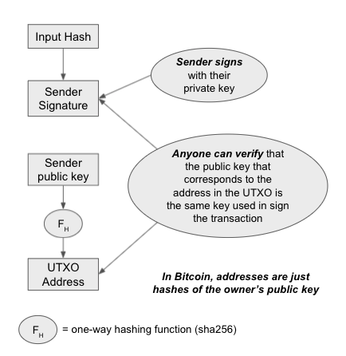
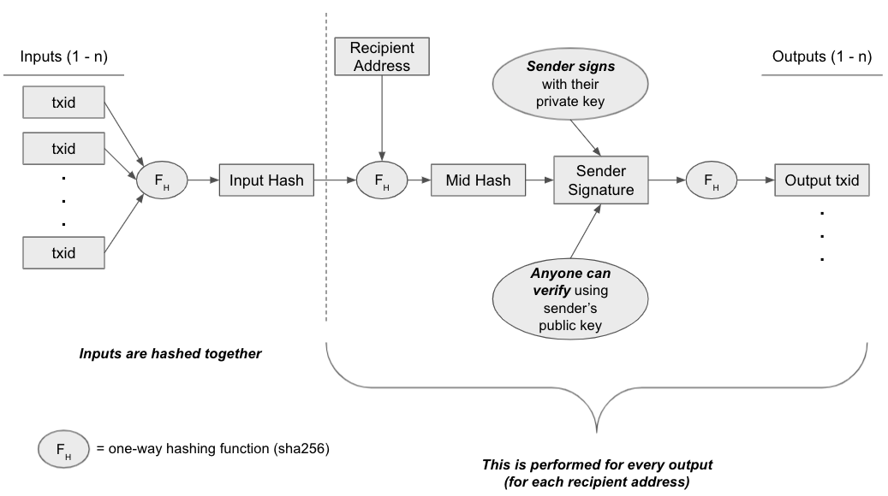

# bitcoin-transactions-and-wallets

[Video](https://user-images.githubusercontent.com/59275828/132078862-0113870c-43e9-4245-916c-d99a01edd1d3.mp4)

Educational project for me to learn about how the Bitcoin network models transactions and how users can send/receive transactions and view their balances (known commonly as "wallets").

This is not designed with security in mind, but rather to understand the design principles behind Bitcoin.

Technical concepts: hashing, cryptography

## Overview

In the Bitcoin network, "coins" are defined as transactions; in other words, balances only actually exist within transactions.

Transactions have inputs and outputs. Unspent transaction outputs (UTXO's) represent existing user balances.

Transactions are chained together similar to blocks, using hashing and public-key cryptography.

Transaction outputs become inputs in following transactions. An owner of a UTXO can "unlock" it via their keys, and build a transaction to any other address on the network.

<i>Each output can only be used as an input once.</i> In Bitcoin, this is verified by the consensus network / miners, which is out of scope for this project.

## Interface

Barebones React app to allow users to create wallets, view balances, and send/receive BTC.

Upon page load or refresh, a new chain with no wallets or transaction history is created.

User will be able to create new wallets, send money from address to address, and see the transaction chain.

## Usage
npm install

npm start

## Implementation Details

### Genesis and Wallet Creation

Upon startup a wallet named "Genesis" is created, along with the "Genesis UTXO" which has 21M BTC.

A new wallet can "deposit" money, which will result in Genesis sending that wallet that amount.

In this way all transactions are chained from the Genesis UTXO.
Wallets can send funds to other wallets but not back to Genesis.

### Building and Chaining Transactions

To build a transaction, a user selects UTXO's that belong to it and uses them as "inputs" for the transaction.

In Bitcoin, they could use these inputs to create as many outputs as they like to various addresses.

In this implementation, the user can select only one address to send to.

If the input value is greater than the target transaction value, a "change output" is created back to the sender's address.

In this way, all transactions are built from a chain of inputs that can be traced back to the Genesis UTXO.

The purpose of this is to create a <i>unique, verifiable, irreversible chain of transactions</i> that holds all the transaction history of the network.

Users can thereby trust the authenticity of the network because they are able to verify it themselves.

Here is a graphic from https://developer.bitcoin.org/devguide/block_chain.html that visualizes it well:


### Transaction Structure

```yaml
Transaction: {
  Sender Public Key: used to verify transaction,
  Signature: sender signature used to verify ownership of transaction inputs,
  Inputs: [{
    Txid: unique TX identifier/hash,
  }],
  Outputs: [{
    Txid: unique TX identifier/hash,
    Signature: sender signature authorizing this transaction output,
    Recipient Address: hash of recipient public key,
    Value: BTC amount
  }]
}
```

"UTXOs" are transaction outputs that have not been used as inputs yet ("unspent"). The state of the "UTXO Set" is managed from the App component and updated after every transaction (UTXOs used as inputs are removed, while the new outputs created are added).

### Verification

There are two components to a transaction that must be verified by the chain:
1. Users who want to use UTXO's as inputs to transactions actually own those UTXOs
2. Transactions are sent by who they are claimed to be sent by

### 1. UTXO Ownership
In Bitcoin, this is accomplished via a locking/unlocking script, which is programmed by a language called Script. Script is Turing-incomplete in order to prevent loops that can be used in DOS attacks against the network.

I adopted a simpler approach in this implementation: a user claiming a UTXO must present their public key and digitally sign the input hash used in their transaction.

The chain verifies that the public key indeed corresponds to that address (the address is simply a hash of the public key) and verifies the signature.



### 2. Transaction Authenticity

More similar to the Bitcoin implementation, a Bitcoin sender hashes together the input transaction hashes, the recipient's address, and digitally signs it. This can similarly be verified by anyone by using the sender's public key.

Here is the full workflow of building a transaction in this implementation:



## Libraries
create-react-app

Nodejs crypto module

key-encoder

styled-components

## References
https://github.com/bitcoinbook/bitcoinbook, especially Chapters 4 and 6

https://developer.bitcoin.org/devguide/block_chain.html

https://bitcoin.org/bitcoin.pdf